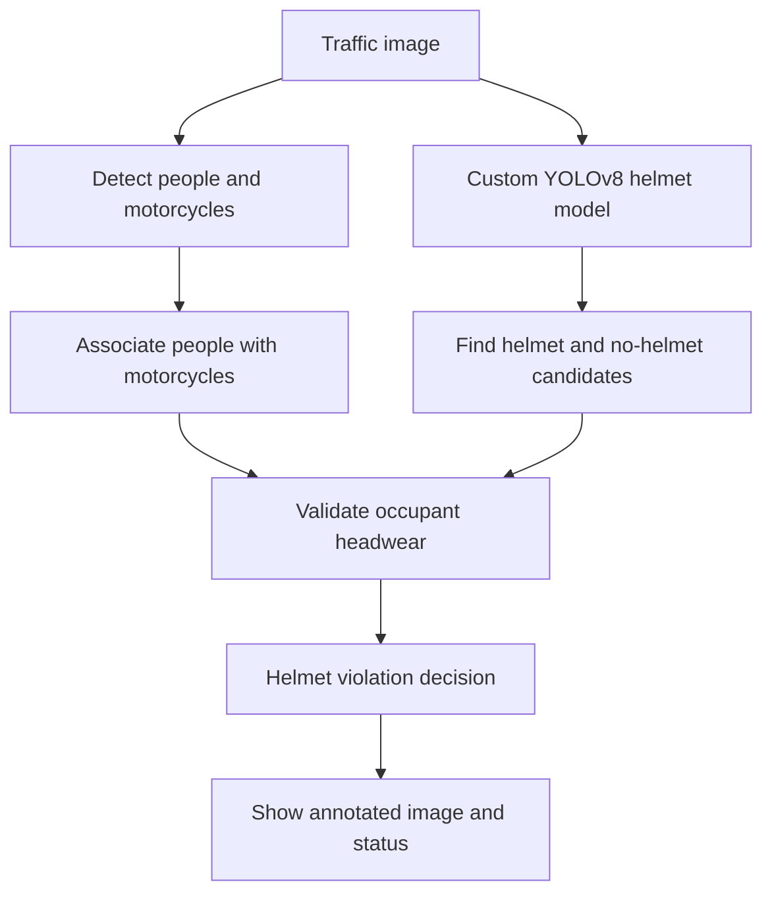
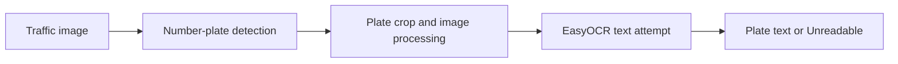
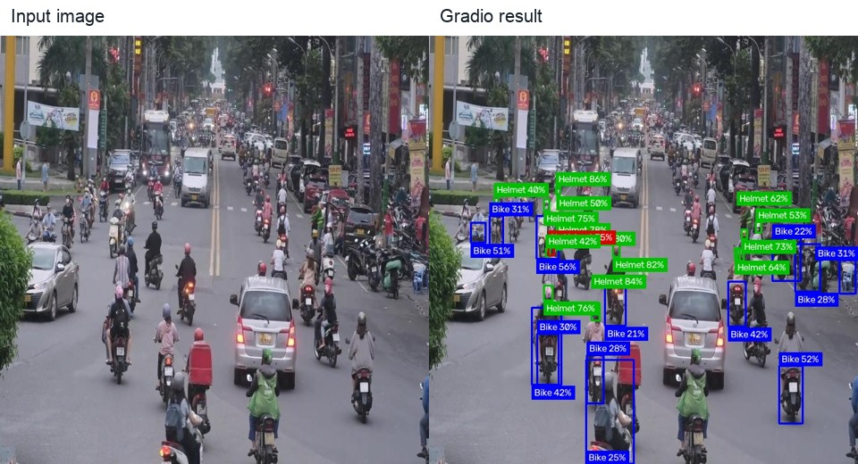
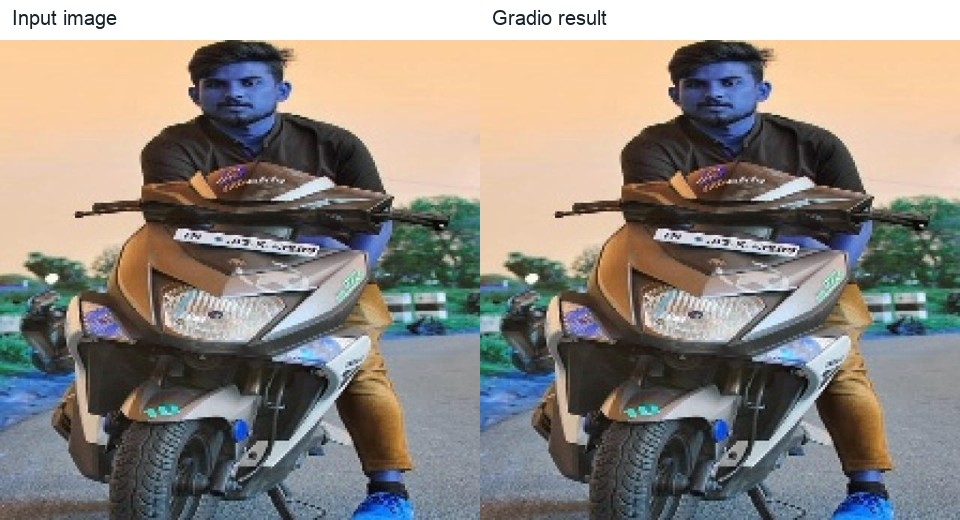

# Motorcycle Helmet Violation Detection

## Project Overview

This project explores deep-learning-based computer vision for identifying motorcycle helmet violations in traffic images. Its primary objective is to detect motorcycle riders and passengers and classify their headwear as **Helmet** or **No Helmet**. The system uses a custom YOLOv8 model and a Gradio interface for image-based inference.

The current application also detects motorcycles and visible license plates, and uses EasyOCR to attempt reading plate text. These are supporting extensions to the helmet-violation workflow. Helmet and no-helmet detection remain the main research and development focus; motorcycle localization and plate detection/OCR have limitations and are planned for further improvement.

> **Project scope:** The primary focus is helmet and no-helmet detection. Motorcycle detection and license plate recognition are supporting features that are still being improved.

## Problem Statement

Motorcycle riders who do not wear helmets face a higher risk of serious injury. Manually reviewing traffic images for helmet use can require substantial effort, especially in crowded scenes with small or partially occluded riders. This project investigates whether deep learning can automatically identify **Helmet** and **No Helmet** cases for people associated with motorcycles and highlight potential violations for review.

The system is an assistive prototype. It does not replace police, make enforcement decisions, or guarantee that every rider is detected correctly.

## Main Objective

The main objective is to develop and evaluate a deep-learning model that distinguishes between **Helmet** and **No Helmet** for people associated with motorcycles. Motorcycle and plate features support this workflow but are not the primary evaluation target.

## Supporting Features

### Motorcycle Detection

Motorcycle detection helps associate headwear predictions with motorcycle occupants. The application combines custom-model bike detections with motorcycle detections from a COCO-pretrained YOLOv8 model. Localization and rider-to-motorcycle association remain imperfect, particularly when motorcycles overlap.

### License Plate Detection

The application attempts to locate visible motorcycle number plates. This supporting feature demonstrates a possible extension of traffic-safety monitoring; it is not the main project objective and is not claimed to work perfectly.

### License Plate OCR

EasyOCR attempts to read text from detected plate regions. Its results depend on plate size, image quality, viewing angle, lighting, occlusion, and country-specific plate formats. OCR is experimental supporting functionality. A plate may be detected while its text remains unreadable.

## Current Project Scope

The current version prioritizes:

1. Helmet detection.
2. No-helmet detection.
3. Identifying a potential helmet violation from validated no-helmet detections associated with motorcycle occupants.

Motorcycle localization and license plate detection/recognition are included as supporting functions. The project does not claim perfect plate detection or OCR.

## System Workflow

The main helmet-violation path is:



The plate path is a separate, optional extension:



## Detection Classes

The custom YOLO model has four classes:

| Class ID | Class | Role in project |
| ---: | --- | --- |
| 0 | `bike` | Supporting motorcycle localization. |
| 1 | `helmet` | Main helmet-use class. |
| 2 | `no-helmet` | Main helmet-violation class. |
| 3 | `number-plate` | Supporting plate detection and OCR. |

Although the model has four classes, **`helmet` and `no-helmet` are the key classes for the main objective**.

## Technologies Used

| Technology | Role |
| --- | --- |
| Python | Application and inference pipeline. |
| PyTorch | Deep-learning framework used by the Ultralytics runtime. |
| YOLOv8 / Ultralytics | Primary detector for helmet, no-helmet, bike, and number-plate classes; a COCO-pretrained YOLOv8 model supplies supporting person and motorcycle detections. |
| OpenCV | Image conversion, cropping, resizing, enhancement, and result annotation. |
| EasyOCR | Supporting, experimental recognition of text in plate crops. |
| Gradio | Web interface for uploading images and viewing results. |
| Google Colab | Reported environment for model training and fine-tuning. |
| Roboflow | Dataset source and YOLO-format export. |
| Git and GitHub | Version control and project hosting. |

## Dataset

The project uses the Roboflow Universe dataset [Helmet and Number Plate Detection for Motorbike Safety](https://universe.roboflow.com/helmet-and-number-plate-detection-project/helmet-and-number-plate-detection-for-motorbike-safety-iityz). The four labeled classes are `bike`, `helmet`, `no-helmet`, and `number-plate`.

Project training notes identify **approximately 8,481 images for Version 4**. Additional difficult no-helmet samples were added to improve coverage of underrepresented or challenging situations, including rear-view riders, crowded scenes, small heads, and multiple riders. More representative helmet/no-helmet examples matter because missed or incorrect headwear predictions affect the project's central objective.

The local ignored `dataset/` directory contains a Roboflow **Version 3** export rather than Version 4. Its metadata reports 20,287 images; its local split directories contain 17,742 training, 1,690 validation, and 855 test images. These counts refer to the local Version 3 export and should not be confused with the approximately 8,481-image Version 4 training set in the project notes. The dataset is excluded from the Git repository.

The Version 3 export metadata records auto-orientation, resizing to fit within 640 × 640 pixels, and generated variants with random rotation between −15° and +15° and Gaussian blur up to 1.5 pixels. The exact Version 4 split counts and final training augmentation settings are not recorded in the repository.

## Training and Fine-Tuning

According to the project training notes, the YOLOv8 model was trained and fine-tuned in Google Colab using an NVIDIA Tesla T4 GPU. The later fine-tuning continued from the earlier model for **10 additional epochs**, using additional difficult samples. Its main purpose was to improve no-helmet detection in challenging cases such as rear views, crowded scenes, small heads, and multiple riders.

The repository does not contain a populated training notebook or the complete training configuration. Batch size, optimizer settings, and exact splits used for each reported run are therefore not specified here. The fine-tuned and original custom weights use the same YOLOv8 detector architecture.

## Evaluation Results

The following are the project-reported model evaluation metrics. They describe object-detection evaluation and do not guarantee the same results on every image or deployment setting.

| Metric | Original model | Fine-tuned model |
| --- | ---: | ---: |
| Precision | — | 0.918 |
| Recall | — | 0.889 |
| mAP@50 | 0.942 | 0.942 |
| mAP@50:95 | 0.675 | 0.690 |

### Per-Class mAP@50:95

| Class | Original model | Fine-tuned model |
| --- | ---: | ---: |
| bike | 0.798 | 0.801 |
| helmet | 0.631 | 0.643 |
| no-helmet | 0.602 | 0.622 |
| number-plate | 0.668 | 0.694 |

The reported **no-helmet mAP@50:95 increased from 0.602 to 0.622**, and **no-helmet recall increased from 0.817 to 0.836**. These changes are relevant to the main violation-detection objective. The overall fine-tuned recall of 0.889 is a separate metric from the class-specific no-helmet recall of 0.836.

- **Precision** measures how often positive predictions are correct.
- **Recall** measures how many relevant objects are found.
- **mAP@50** is mean average precision at an intersection-over-union threshold of 0.50.
- **mAP@50:95** averages mean average precision across IoU thresholds from 0.50 through 0.95.

### Fine-Tuning Example

Project notes include one image-level comparison from the fine-tuning experiment:

| Detections in example image | Original model | Fine-tuned model |
| --- | ---: | ---: |
| Bikes | 5 | 5 |
| Helmets | 12 | 9 |
| No-helmets | 1 | 4 |

This single example shows more no-helmet detections in that image after fine-tuning. It is qualitative evidence for that case, not an aggregate metric or a guarantee of improvement in every scene.

## Helmet Violation Logic

The application associates headwear detections with detected people and motorcycles. A person must be associated with a motorcycle, and the headwear prediction must meet the app's spatial and confidence checks. If at least one motorcycle occupant has a validated **No Helmet** prediction, the application reports **Helmet Violation Detected**.

The absence of a helmet detection does **not** automatically mean that a person is not wearing a helmet. A valid no-helmet prediction is required. If no occupant is validated as no-helmet, the app reports **No Violation Detected**; this means no violation was detected by the current model and checks, not that every occupant's helmet status is known with certainty.

## Web Application

The Gradio application lets a user upload a traffic image and run inference. It displays the annotated image, helmet/no-helmet and motorcycle boxes, optional plate boxes, a helmet-violation status, an occupant summary, and any recognized plate text. Helmet status is the primary result. The application analyzes uploaded images; video and live-camera inference are not implemented.

Inference runs locally after dependencies and model files are available. Google Colab is used for the reported training workflow, not required to run the web interface.

## Current Limitations

### Helmet Detection

- Hats or beanies may sometimes be confused with helmets.
- Small or distant heads may be missed.
- Occlusion, lighting, and unusual viewing angles can affect predictions.
- Crowded motorcycles and multiple passengers remain challenging to associate correctly.
- The model can miss a helmet even when one is visibly present. For example, the single-rider comparison image below shows a helmeted rider whose helmet was not validated by the application; this is a missed classification, not a successful no-helmet example.

### Motorcycle Detection

- Duplicate detections may occur in difficult scenes.
- Overlapping motorcycles can be difficult to separate.
- Errors in person-to-motorcycle association can affect occupant-level results.

### License Plate Detection and OCR

License plate detection and OCR are supporting experimental features. Their limitations include:

- Small or distant plates may not be detected or may not contain enough pixels for OCR.
- Angled, occluded, or partial plate regions may be missed or cropped incompletely.
- OCR may return unreadable or incorrect text.
- Country-specific formats, including Cambodian plate layouts, may reduce generalization.
- Plate detection and OCR have not been established as perfect or reliable enforcement tools.

The results images illustrate individual runs and failure cases; they do not replace the quantitative evaluation above. The local `results/results.png`, `results/confusion_matrix.png`, and `results/sample_detection.png` files are empty in this repository snapshot, so they are not presented as evaluation figures.

## Future Work

### Helmet Detection Improvements

- Collect more difficult helmet/no-helmet images.
- Add examples of hats, caps, beanies, scarves, and bare heads.
- Improve association for multiple riders and passengers.
- Reduce false helmet detections and improve small-head detection.
- Evaluate other object-detection architectures using consistent data splits and metrics.
- Evaluate real-time video performance on defined hardware.

### Motorcycle Detection Improvements

- Improve motorcycle localization and reduce duplicate boxes.
- Improve detection in crowded traffic and overlapping-bike scenes.
- Improve rider-to-motorcycle association.

### License Plate Improvements

License plate recognition is planned as a future extension. Potential improvements include:

- Collect more Cambodian motorcycle plate images.
- Improve full-plate annotations.
- Train a dedicated license plate detector.
- Improve small and angled plate detection.
- Evaluate stronger OCR models and perspective correction.
- Support Cambodian plate formats and multi-line text recognition.

## Future Project Direction

The long-term goal is a more complete motorcycle traffic-safety system. The current project focuses mainly on helmet violation detection. Future versions will improve the supporting motorcycle and plate components so they can contribute more reliably to end-to-end traffic-violation analysis.

## Project Structure

```text
motorcycle-helmet-violation-detection/
├── app/
│   └── app.py
├── model/
│   ├── archive/
│   │   └── helmet_best_old.pt
│   ├── coco/
│   │   └── yolov8n.pt
│   └── helmet_best.pt
├── notebook/
│   └── helmet_violation_detection.ipynb
├── results/
│   ├── examples/
│   │   ├── crowded_traffic_comparison.jpg
│   │   ├── crowded_traffic_input.jpg
│   │   ├── crowded_traffic_result.jpg
│   │   ├── single_rider_comparison.jpg
│   │   ├── single_rider_input.jpg
│   │   └── single_rider_result.jpg
│   ├── confusion_matrix.png
│   ├── results.png
│   └── sample_detection.png
├── requirements.txt
├── .gitignore
└── README.md
```

The local `dataset/`, `.venv/`, and temporary inference images are excluded from Git. The `test_images/` and `test_videos/` directories are empty and are not tracked.

## Installation

Clone the repository and enter its directory:

```bash
git clone https://github.com/Jingjing468/motorcycle-helmet-violation-detection.git
cd motorcycle-helmet-violation-detection
```

Create and activate a Python 3.11 virtual environment on macOS or Linux:

```bash
python3.11 -m venv .venv
source .venv/bin/activate
```

Install the dependencies:

```bash
pip install -r requirements.txt
```

## Run the Application

From the repository root, start the Gradio application:

```bash
python app/app.py
```

Open the local Gradio URL printed in the terminal (commonly `http://127.0.0.1:7860`).

## Hardware and Environment

- **Training and fine-tuning:** Google Colab with an NVIDIA Tesla T4, as reported in the project notes.
- **Local testing:** MacBook.
- **Python:** 3.11.
- **Inference speed:** Varies by hardware, image size, OCR, and number of second-pass detections. A formal FPS benchmark is not included.

## Results and Example Images

The tables above contain the reported model metrics. The images below are manually run and reviewed examples from the local Version 3 test split. Their summaries describe individual application runs, not dataset-wide performance.

| Example | Input and application result | Observed application summary |
| --- | --- | --- |
| Crowded traffic |  | 13 motorcycles; 14 helmeted occupants; 1 validated no-helmet occupant; 0 plates detected. The app reported a helmet violation. |
| Single rider — missed helmet classification |  | The rider appears to be wearing a helmet, but the application did not validate the helmet class. This is an example of a missed classification, not a no-helmet success. |

The source dataset export identifies its license as CC BY 4.0. Check the dataset terms and attribution requirements before redistribution.

## AI Assistance Disclosure

**Tools used:** ChatGPT and OpenAI Codex.

AI assistance was used for debugging, code organization, README documentation, inference-pipeline improvements, and technical explanations. The project author remains responsible for checking the code and descriptions. The displayed example results were manually tested and reviewed; reported metrics are presented as recorded in the project notes.

## Conclusion

This project demonstrates the use of deep learning for motorcycle helmet violation detection. Its main achievement is detecting helmet and no-helmet cases with a fine-tuned YOLOv8 model. Motorcycle detection and license plate detection/OCR were integrated as supporting features to explore a broader traffic-safety workflow, but they still require further development. Future work will prioritize more reliable helmet classification, stronger motorcycle association, and dedicated plate detection and OCR.

## References

- [Ultralytics YOLO documentation](https://docs.ultralytics.com/)
- [PyTorch documentation](https://pytorch.org/docs/stable/index.html)
- [EasyOCR project](https://github.com/JaidedAI/EasyOCR)
- [Gradio documentation](https://www.gradio.app/docs)
- [Roboflow Universe dataset: Helmet and Number Plate Detection for Motorbike Safety](https://universe.roboflow.com/helmet-and-number-plate-detection-project/helmet-and-number-plate-detection-for-motorbike-safety-iityz)
